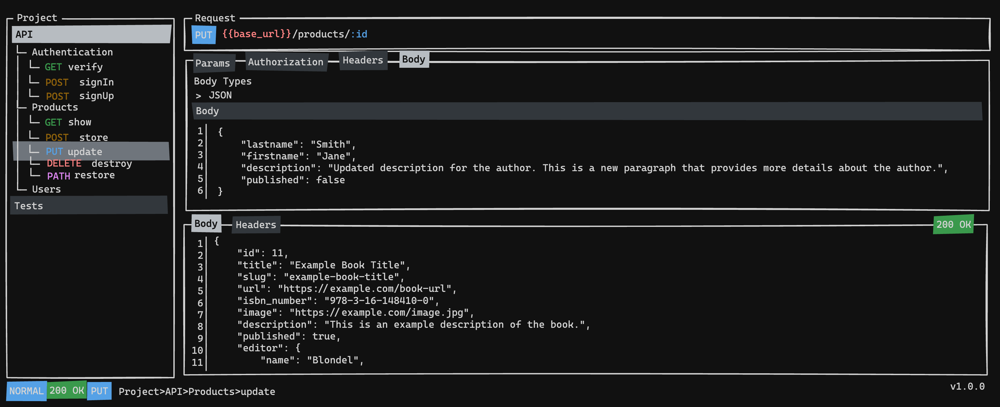

<h1 align="center">
  
  <br />
  LazyCurl
</h1>

<p align="center">
  <strong>A powerful Terminal User Interface (TUI) HTTP client</strong><br />
  Combining <strong>Lazygit</strong>'s elegant interface with <strong>Postman</strong>'s API testing capabilities
</p>

<p align="center">
  <a href="https://github.com/kbrdn1/LazyCurl/actions/workflows/ci.yml"></a>
  <a href="https://github.com/kbrdn1/LazyCurl/releases"></a>
  <a href="https://codecov.io/gh/kbrdn1/LazyCurl"></a>
  <a href="https://goreportcard.com/report/github.com/kbrdn1/LazyCurl"></a>
</p>

<p align="center">
  
  
  
</p>

---

## Features

- **Lazygit-Style Interface** — Multi-panel layout with vim motions (`h/j/k/l`)
- **Collections & Environments** — Organize requests, manage variables with `{{var}}` syntax
- **Import/Export** — cURL, OpenAPI 3.x, Postman collections
- **External Editor** — Edit bodies in vim, VS Code, nano, etc.
- **Session Persistence** — Auto-save/restore your workspace state
- **Jump Mode** — vim-easymotion style quick navigation

```
┌─Collections────────┬─Request──────────────────────────┐
│                    │ POST    {{base_url}}/api/users   │
│ ▼ My API           │──────────────────────────────────│
│   ▶ Users          │ Params │ Auth │ Headers │ Body   │
│     GET  /users    │──────────────────────────────────│
│     POST /users    │ {                                │
│   ▶ Products       │   "name": "{{user_name}}"        │
│                    │ }                                │
│                    ├─Response─────────────────────────┤
│                    │ 201 Created  │ 142ms │ 1.2 KB    │
└────────────────────┴──────────────────────────────────┘
 NORMAL │ POST │ My API > Users │ dev │ ?:help
```

---

## Installation

### From Source

```bash
git clone https://github.com/kbrdn1/LazyCurl.git
cd LazyCurl
make build
./bin/lazycurl
```

### Using Go Install

```bash
go install github.com/kbrdn1/LazyCurl/cmd/lazycurl@latest
```

---

## Quick Start

```bash
# Navigate to your project
cd my-api-project

# Launch LazyCurl (creates .lazycurl/ workspace)
lazycurl

# Press 'n' to create a request, 'Ctrl+S' to send
# Press '?' for keybinding help
```

**Import existing APIs:**

```bash
# Import OpenAPI spec
lazycurl import openapi api.yaml

# Import Postman collection
lazycurl import postman collection.json
```

---

## Key Shortcuts

| Action | Key |
|--------|-----|
| Navigate panels | `h` / `l` |
| Move in list | `j` / `k` |
| New request | `n` |
| Send request | `Ctrl+S` |
| Import cURL | `Ctrl+I` |
| Import OpenAPI | `Ctrl+O` |
| Import Postman | `Ctrl+P` |
| External editor | `Ctrl+E` |
| Jump mode | `f` |
| Help | `?` |

---

## Documentation

Full documentation available in [`docs/`](docs/index.md):

| Guide | Description |
|-------|-------------|
| [Getting Started](docs/getting-started.md) | First steps with LazyCurl |
| [Keybindings](docs/keybindings.md) | Complete keyboard reference |
| [Import/Export](docs/import-export.md) | cURL, OpenAPI, Postman |
| [Collections](docs/collections.md) | Organize requests |
| [Environments](docs/environments.md) | Variable management |
| [Configuration](docs/configuration.md) | Customization options |

---

## Contributing

Contributions welcome! See [CONTRIBUTING.md](CONTRIBUTING.md) for guidelines.

```bash
# Development with live reload
make dev

# Run tests
make test
```

---

## License

[MIT License](LICENSE)

---

<p align="center">
  Made with ❤️ by <a href="https://github.com/kbrdn1">@kbrdn1</a>
</p>
